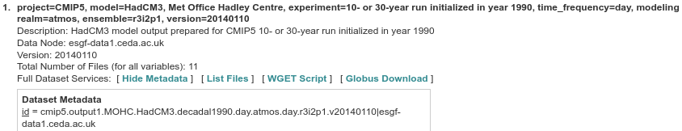

CMIP data
=========

This page contains information on how data from the Coupled Model
Intercomparison Project (CMIP) are stored in  our NS9039K data structure in
NIRD. This includes both CMIP5 and CMIP6 data, which have a slightly different
structure.

We have endeavoured to keep the original structure of the CMIP data, but a
small change has been made to the CMIP5 data structure in order to integrate it
with our data storage structure.

CMIP6
-----

Original structure
##################

Information is avaiable about CMIP6 metadata
`here <https://pcmdi.llnl.gov/CMIP6/Guide/dataUsers.html>`_.

 | ESGF CMIP6 data follows the data structure:
 | **<mip_era>/<activity_id>/<institution_id>/<source_id>/<experiment_id>/<variant_label>/<table_id>/<variable_id>/<grid_label>/<version>/**

 | For example:
 | **CMIP6/PAMIP/NCC/NorESM2-LM/pdSST-pdSIC/r46i1p1f1/Amon/psl/gn/v20190920/**

NIRD structure
##############

CMIP6 data is stored in NIRD under /projects/NS9039K/data/external/model/CMIP6.
We use the same structure as the ESGF structure in our internal storage on NIRD.

Downloading CMIP6 data
######################

Download
`here <https://esgf-node.llnl.gov/projects/cmip6/>`_.

When downloading CMIP6 data from the ESGF node, if we do not have existing data
in this activity, you will have to construct this directory structure yourself.
All the information is available in the data search results, for example, in the
first and third lines in :numref:`CMIP6-search`.

.. figure::
  ESGF_CMIP6.png
  :name: CMIP6-search
  :width: 800
  :alt: An image of CMIP6 data search results.

  Metadata provided in the ESGF CMIP6 data search.

Please do not modify the names of the CMIP6 data after downloading, the
filenames also contain most of the metadata required to produce the data
structure (except the MIP era, Activity ID, Institution ID and version).

 | Filenames take the form:
 | **<variable_id>_<table_id>_<source_id>_<experiment_id>_<variant_label>_<grid_label>[<_temporal_subset>].nc**

 | For example:
 | **psl_Amon_NorESM2-LM_pdSST-pdSIC_r46i1p1f1_gn_200006-200105.nc**

CMIP5
-----

Original structure
##################

Information is available about CMIP5 metadata
`here <https://pcmdi.llnl.gov/mips/cmip5/docs/CMIP5_output_metadata_requirements_4Jan11_clean.pdf?id=84>`_,

 | ESGF CMIP5 data follows the data structure:
 | **<activity>/<product>/<institute>/<model>/<experiment>/<frequency>/<modeling realm>/<CMIP table/<variable name>/<ensemble member>/<version>**

 | For example:
 | **/CMIP5/output1/MOHC/HadDCM3/decadal1990/day/atmos/day/tas/r3i2p1/v20140110**

Note that this differs a little from the above document, where the CMIP table
(e.g. day or Omon) and version, is not required.

NIRD structure
##############

CMIP5 data is stored in NIRD under /projects/NS9039K/data/external/model/CMIP5.
Our structure is based on the ESGF structure but differs in that the <output> is
divided into 'PMIP' and 'CMIP'. 'PMIP' contains data from the Paleoclimate
Modelling Intercomparison Project (the experiments 'past1000', 'lgm' and
'midHolocene'), and 'CMIP' contains all other CMIP5 data.
The rest of the structure remains the same.

Downloading CMIP5 data
######################

Download
`here <https://esgf-node.llnl.gov/search/cmip5/>`_.

When downloading CMIP6 data from the ESGF node, if we do not have existing data
in this activity, you will have to construct this directory structure yourself.
All the information is available in the data search results, for example, in the
'id' at the bottom of :numref:`CMIP5-search`.

  Metadata provided in the ESGF CMIP5 data search.

Please do not modify the names of the CMIP5 data after downloading.

Processing CMIP data
--------------------

If you would like to compress the CMIP data, you can do this and leave it in
the original data structure. For other processing tasks such as regridding,
or generation of new composite variables, please save the output of such
processing in a 'derived' directory. This should be in the location:
/projects/NS9039K/data/external/model/<mip_era>/<activity_id>/<derived>/<ui_d>/
where <ui_d> is a directory with your user initials followed by a brief
description. For example, there is a derived dataset in the following location:
/projects/NS9093K/data/external/model/CMIP6/PMIP/derived/lb_1.5x1.5/ which
corresponds to CMIP6 data regridded to a regular 1.5 degree grid.
